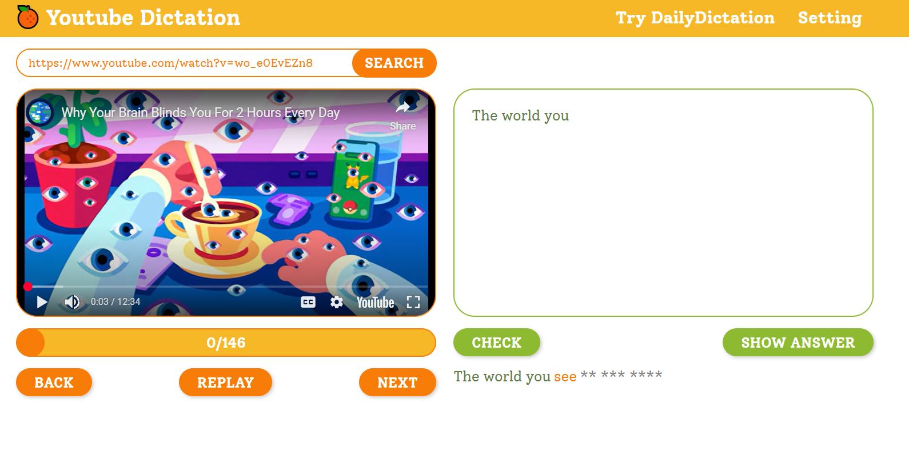

# Youtube Dictation Website

Practicing dictation with youtube videos



## Usage

Start server:


```
docker-compose up -d
```

Your website will be available at "http://localhost:8005/"


## Todo

- [x] Toggle check button into next button
- [x] Clear hint when press next or back
- [x] Auto clear when go to next segment
- [x] Add setting
- [x] Responsive UI
- [ ] Add random chatbot
- [ ] Add Ads